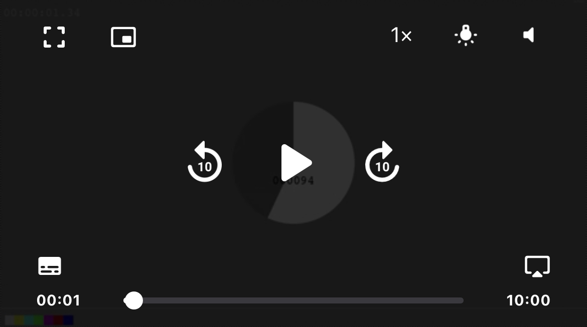
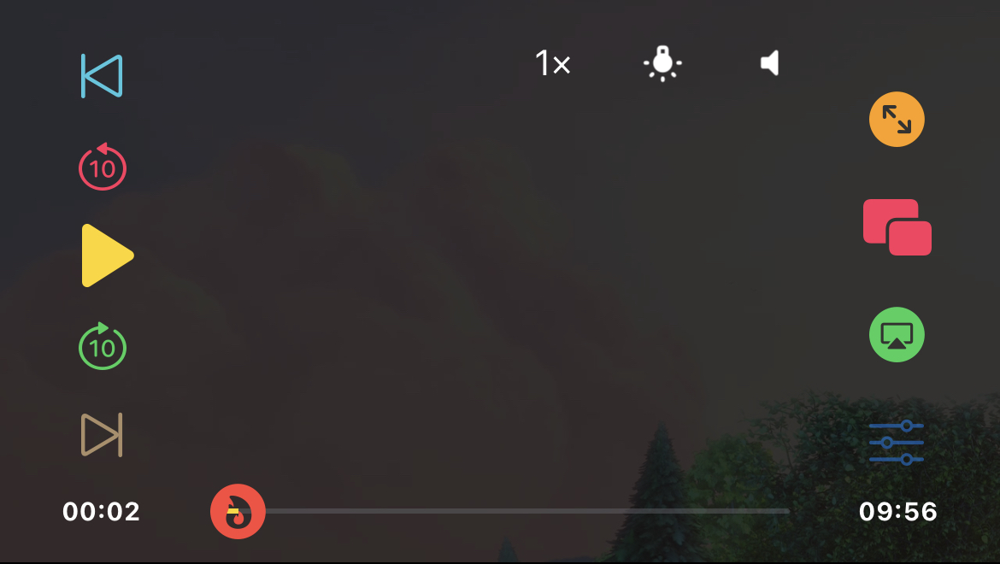
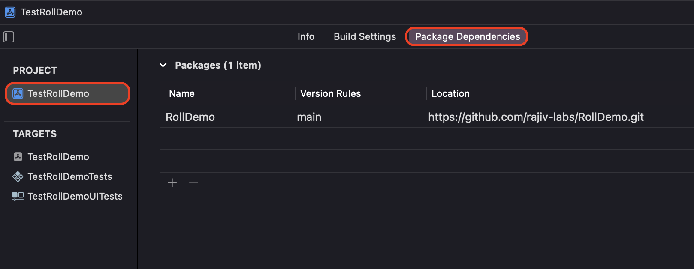
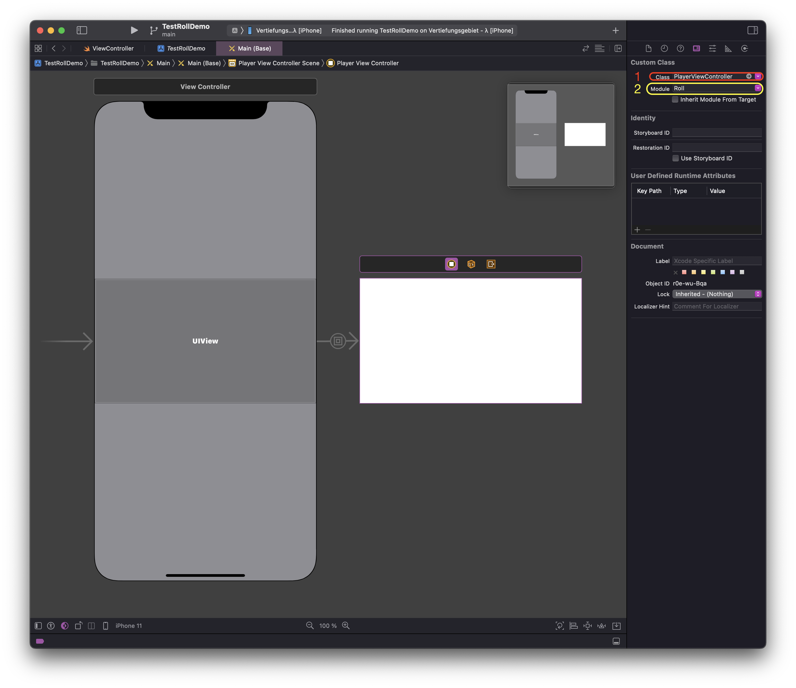

# RollDemo


This package is a demo version of Roll player which is a native iOS audiovisual player that builds on `AVFoundation`.

Contact Information:
- [Rajiv Labs email](mailto:rajiv.jhoomuck@icloud.com)
- [Twitter](https://twitter.com/rajivjhoomuck)
- [Create a Github issue](https://github.com/rajiv-labs/RollDemo/issues/new)

> ⚠️: This package is a demo version of the full player, so some features have been disabled. Also playback will be interrupted after some time. If you would like to try the full player, please send an email to rajiv.jhoomuck@icloud.com or by creating an issue on GitHub. (Email will work best though)



Features of Roll player include (non-exhaustive):
- Playback of Live and VOD streams
- Playlist support, even in PiP mode!
- Smart error recovery (when applicable) while preserving playhead information
- Picture-in-Picture mode (supporting devices)
- AirPlay support
- Now Playing Info support
- Optimized time to playback
- Playback start at a specific time
- Playback control via Siri
- Playback speed control
- Screen dimming control
- Volume control
- Audio and subtitles selection (for supported HLS streams)
- Usual video controls (play, pause, stop, rewind, fast forward and seek through the video)

A default UI is provided but you can customize the UI controls as you wish, like in the following example:


## Installation
You can bring the Roll Demo to your project using SPM only.

## Getting Started
*The easiest way to test Roll Demo is to use a storyboard file in order to embed an instance of the player in your view controller hierarchy, but you can also embed the player in code if you wish.<br>
This guide will go with storyboards*

- Add Roll demo package to you project.


- Then in you storyboard file:
  1) add a view controller that embeds the player.
  2) Set the embedded view controller's class to `PlayerViewController` from the module, `Roll`.
  

- Open you container view controller from the storyboard (the one that embeds the player view controller) and intercept the embedding process in order to be able to inject a stream in to the player:
```swift
import Roll
import UIKit

class ViewController: UIViewController {
  // implementations

  // 1:
  override func prepare(for segue: UIStoryboardSegue, sender: Any?) {
    guard
        segue.identifier == "player_embed"
      , let playerViewController = segue.destination as? PlayerViewController
    else {
      return
    }

    // 2:
    let stream = StreamRepresentation(
      id: "Stream Id",
      location: URL(string: "https://example.apple.com/videos/bestmovie/master.m3u8")!,
      title: "Bonzy Title",
      supplementaryTitle: "Paro Supplementary Title",
      trait: .replay()
    )

    // 3:
    playerViewController.replace(stream: stream)
  }

  // other implementations
}
```
`// 1:`<br>
We check that we are embedding the player, which is an instance of `PlayerViewController`.


`// 2:` <br>
A playable stream defined using `StreamRepresentation`. This structure encapsulates useful information / configuration about the stream. For our purpose, we will focus on providing:
  - `id`: A unique identifier for the stream (depends on how you identify streams in your organization).
  - `location`: The `URL` of the stream.
  - `title`: The title of the stream. This might be used for display in the UI.
  - `supplementaryTitle`: A supplementary title for the stream. This might be used for display in the UI also.

`// 3:` <br>
Set the stream on the player to start playback.

## Full featured Roll player
If you have tried and loved the Roll Demo, you can reach me through one of the following channels:
- [Rajiv Labs email](mailto:rajiv.jhoomuck@icloud.com)
- [Twitter](https://twitter.com/rajivjhoomuck)
- [Create a Github issue](https://github.com/rajiv-labs/RollDemo/issues/new)
